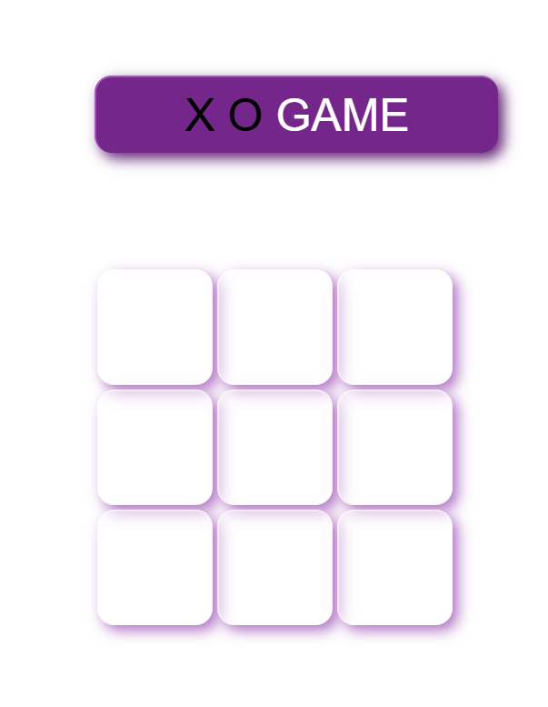

## (Tic-Tac-Toe)

A simple and interactive X-O (Tic-Tac-Toe) web game where two players can challenge each other locally on the same device.

## Features

- Two-player mode
- Winning & draw detection
- Scoreboard (optional)
- Clean and responsive UI

## Live Demo
[Click here to view website]( https://ayaahmed222.github.io/Tic-Tac-Toe_web-game/)

## Review

## Technologies Used
- HTML5
- CSS3
- JavaScript
- Git & GitHub

## Author
- **Aya Ahmed Shawky**
- [LinkedIn](https://www.linkedin.com/in/aya-ahmed-15b114247/)
- [GitHub](https://github.com/ayaahmed222)
